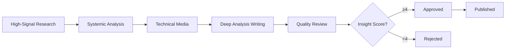

# Authority Content Pipeline (lookforward Edition)

End-to-end workflow: High-Signal Research → Systemic Analysis → Technical Media → Deep Insight → Quality Review

## 🎯 Objective
Transform high-signal tech trends into authority-building content with Insight Score 4-5.

**Philosophy**: "We do not create noise. We create clarity."

## 📋 Steps

### 1. High-Signal Research Phase (if not already done today)

Check if today's tech trends exist:
```powershell
$todayPath = "01_Research/trends/$(Get-Date -Format 'yyyy-MM-dd')/daily_tech_trends.md"
if (-not (Test-Path $todayPath)) {
    Write-Host "⚠️  No tech trends found for today. Running high-signal scan first..."
    # Run daily-trend-scan workflow
}
```

// turbo
### 2. Review and Select High-Signal Trends

Open the tech trends report:
```powershell
code "01_Research/trends/$(Get-Date -Format 'yyyy-MM-dd')/daily_tech_trends.md"
```

**User Action**: Select 1-2 trends with highest systemic significance.

**Quality Gate**:
- [ ] Trend from primary source (ArXiv, Official Blog, Whitepaper)
- [ ] Has technical depth for analysis
- [ ] Potential Insight Score ≥ 4
- [ ] Not clickbait or price speculation

### 3. Systemic Analysis Phase

// turbo
For each selected trend, run ContentStrategist:
```powershell
Write-Host "🧠 Analyzing for systemic impact and non-obvious angles..."
# Agent invokes ContentStrategist skill
# Outputs to: 02_Strategy/content_plans/YYYY-MM-DD_[topic].md
```

Review generated strategies:
```powershell
code "02_Strategy/content_plans/"
```

**User Action**: Review strategy for:
- [ ] Non-obvious angle identified
- [ ] Systemic connection clear
- [ ] Future vision compelling
- [ ] Insight Score target 4-5

**Auto-Reject if**:
- Strategy contains "INSIGHT_LOW" flag
- No systemic analysis present
- Just news summarization

### 4. Technical Media Sourcing Phase

// turbo
For each approved strategy, run MediaSourcing:
```powershell
Write-Host "🎨 Sourcing technical visuals..."
# Agent invokes MediaSourcing skill
# Downloads to: 03_Media/
```

The agent will:
- Search for official diagrams (GitHub, ArXiv)
- Download technical screenshots
- Create data visualizations if needed
- Generate metadata files

**Quality Gate**:
- [ ] Visuals are technical (not generic stock photos)
- [ ] Diagrams/charts support key points
- [ ] Sources properly attributed
- [ ] Alt text written

### 5. Deep Analysis Writing Phase

// turbo
For each strategy with media, run ContentWriter:
```powershell
Write-Host "✍️ Writing deep tech analysis..."
# Agent invokes ContentWriter skill
# Outputs to: 04_Drafts/YYYY-MM-DD_[topic]_[platform].md
```

The agent will:
- Follow Synthesis Framework (Update → Breakdown → Impact → Vision)
- Use Calm & Sharp tone (no hype)
- Include technical details
- Add Value CTA
- Target Insight Score 4-5

**Auto-Check**:
- No forbidden words ("ตะลึง", "ช็อก", "🚨")
- No AI-speak ("ในยุคปัจจุบัน", "อย่างไรก็ตาม")
- Proper structure followed

### 6. Quality Review Phase

// turbo
For each draft, run ContentReviewer:
```powershell
Write-Host "🔍 Running quality control..."
# Agent invokes ContentReviewer skill
# Outputs review report with scoring
```

**Scoring Criteria** (100 points):
- Fact Accuracy (30 pts)
- Insight Density (30 pts) - **Must score 4-5**
- Logic & Structure (20 pts)
- No-Hype Integrity (20 pts)

**Decision Tree**:
```
Score 90-100 (Insight 5) → ✅ Approved (Excellent)
Score 85-89 (Insight 4) → ✅ Approved (Very Good)
Score 75-84 (Insight 3-4) → ⚠️ Needs Work (Apply edits)
Score < 75 (Insight < 3) → ❌ Rejected (Rewrite)
```

### 7. Manual Review & Approval

Open drafts and review reports:
```powershell
code "04_Drafts/"
```

**User Action**: For each draft, verify:
- [ ] Insight Score ≥ 4 (non-negotiable)
- [ ] Facts are accurate
- [ ] Systemic analysis present
- [ ] No hype language
- [ ] Future vision compelling
- [ ] Technical visuals linked

**Actions**:
```powershell
# Move approved drafts (Score ≥ 85)
Move-Item "04_Drafts/2026-02-08_topic_facebook.md" "04_Drafts/approved/"

# Move rejected drafts (Score < 75)
Move-Item "04_Drafts/2026-02-08_topic_facebook.md" "04_Drafts/rejected/"

# For 75-84: Apply suggested edits and re-review
```

### 8. Publish to Archive

```powershell
# Move approved content to published archive
Move-Item "04_Drafts/approved/2026-02-08_topic_facebook.md" "05_Published/"
```

### 9. Schedule Publishing (Optional)

// turbo
If using automated posting:
```powershell
# Invoke FacebookPoster skill
# Post at optimal time (TBD based on performance data)
```

Or manually schedule via Facebook Creator Studio.

## 📊 Pipeline Summary



## ⏰ Execution Time Estimate
- **Research**: 10-15 minutes (high-signal sources)
- **Analysis**: 5-10 minutes per trend (deep thinking)
- **Media**: 5-10 minutes per strategy (technical visuals)
- **Writing**: 5-10 minutes per strategy (authority content)
- **Review**: 10-15 minutes (quality control)

**Total**: ~40-60 minutes for 1-2 authority posts (Quality > Speed)

## 🎯 Expected Outputs

After running this pipeline for 2 trends:

```
01_Research/trends/2026-02-08/
└── daily_tech_trends.md

02_Strategy/content_plans/2026-02-08/
├── deepseek_architecture.md
└── crypto_regulation_analysis.md

03_Media/2026-02-08/
├── deepseek_architecture/
│   ├── architecture_diagram.png
│   ├── cost_comparison_chart.png
│   └── metadata.json
└── crypto_regulation_analysis/
    ├── regulation_timeline.png
    └── metadata.json

04_Drafts/2026-02-08/
├── approved/
│   ├── facebook_deepseek_architecture.md (Score: 92)
│   └── facebook_crypto_regulation.md (Score: 88)
└── rejected/
    └── facebook_generic_news.md (Score: 65, Insight: 2)

05_Published/
├── 2026-02-08_deepseek_architecture_facebook.md
└── 2026-02-08_crypto_regulation_facebook.md
```

## 🔧 Customization Options

### Run Partial Pipeline
```bash
# Only analysis for existing research
agent run authority-content-pipeline --start-from analysis

# Only media + writing for existing strategies
agent run authority-content-pipeline --start-from media

# Only writing for existing strategies + media
agent run authority-content-pipeline --start-from writing
```

### Filter by Platform
```bash
# Only create Facebook content (primary)
agent run authority-content-pipeline --platform facebook

# Multiple platforms
agent run authority-content-pipeline --platforms facebook,twitter
```

### Trend Selection
```bash
# Auto-select top N trends (by technical significance)
agent run authority-content-pipeline --auto-select 2

# Prompt for manual selection
agent run authority-content-pipeline --interactive
```

## 🚨 Error Handling

### Research Phase Fails
- Fall back to manual tech topic input
- Use curated tech sources list
- Skip to analysis phase with predefined topics

### Analysis Phase Returns "INSIGHT_LOW"
- **Do not proceed** - Quality > Quantity
- Select different trend
- Report "No High-Signal Trends Found" if all fail

### Media Sourcing Fails
- Use text-only drafts (acceptable for authority content)
- Notify user to manually provide technical visuals
- Continue with analysis focus

### Quality Review Rejects (Score < 75)
- **Do not publish** - Maintain brand integrity
- Analyze feedback
- Rewrite with stronger systemic angle
- Or abandon topic if Insight Score can't reach 4

## ✅ Quality Gates

Before moving to next phase:
- [ ] **Research**: Minimum 1 high-signal trend from primary source
- [ ] **Analysis**: Non-obvious angle + systemic connection identified
- [ ] **Media**: Technical visuals sourced (or text-only approved)
- [ ] **Writing**: Synthesis Framework followed, no hype detected
- [ ] **Review**: Insight Score ≥ 4, Total Score ≥ 85
- [ ] **Approval**: User verification complete

## 💡 Usage Examples

### Quick Daily Run (Authority Mode)
```bash
# Full automation for 1-2 high-quality posts
cd c:\Users\User\.gemini\antigravity\scratch\content-automation\Engagement
agent run authority-content-pipeline --auto-select 2
```

### Custom Workflow
```bash
# 1. Morning high-signal scan
agent run daily-trend-scan

# 2. Review tech trends (manual)
code 01_Research/trends/2026-02-08/daily_tech_trends.md

# 3. Create authority content for top 2
agent run authority-content-pipeline --auto-select 2 --platform facebook

# 4. Review quality reports
code 04_Drafts/2026-02-08/

# 5. Approve and publish (manual)
# Move approved to 05_Published/
```

## 📈 Success Metrics (Authority-Focused)
- **Quality**: 100% of published content has Insight Score ≥ 4
- **Throughput**: 1-2 authority posts in 40-60 minutes
- **Approval Rate**: 80%+ of drafts pass review (Score ≥ 85)
- **Rejection Rate**: <20% (maintain high standards)
- **Efficiency**: Minimal manual intervention (except approval)

## 🔄 Iteration Tips
- **Quality over quantity**: 2 excellent posts > 5 mediocre ones
- **Track Insight Score correlation**: Monitor engagement vs Insight Score
- **Refine non-obvious angles**: Build library of successful angles
- **Update brand guidelines**: Codify lessons learned
- **Compound authority**: Each post builds on previous trust

## 🎯 Authority Building Principles

1. **Depth > Speed**: Take time to find systemic connections
2. **Clarity > Hype**: Calm tone builds more trust than excitement
3. **Insight > News**: Non-obvious angles are our competitive advantage
4. **Quality > Quantity**: 12 great posts/week > 20 mediocre ones
5. **Authority compounds**: Each insight builds on the last

---

**Version**: 2.0 (Authority Edition)  
**Last Updated**: 2026-02-08  
**Alignment**: lookforward Brand (Tech Authority)
