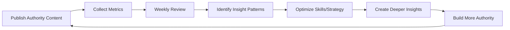

# Performance Review Workflow (lookforward Edition)

Weekly retrospective to analyze authority content performance, identify what resonates, and compound trust-building.

## 🎯 Objective
Systematic weekly review to drive continuous improvement through data-driven insights for **authority content**.

**Philosophy**: "Authority compounds over time" - Track what builds trust, not just engagement.

## ⏰ Schedule
**When**: Every Monday, 10:00 AM  
**Duration**: 30-45 minutes

## 📋 Steps

### 1. Generate Weekly Analytics

// turbo
```powershell
# Run PerformanceAnalyzer for last week
$lastWeek = (Get-Date).AddDays(-7).ToString("yyyy-MM-dd")
python .agent/skills/PerformanceAnalyzer/analyzer.py --weekly --start-date $lastWeek
```

Output: `07_Analytics/performance_metrics/YYYY-WW_weekly.md`

### 2. Review Performance Report

Open and review:
```powershell
code "07_Analytics/performance_metrics/$(Get-Date -UFormat '%Y-W%V')_weekly.md"
```

Focus on:
- 📊 Overall weekly metrics vs goals
- 🏆 Top 5 performers (Insight Score correlation)
- 📉 Underperformers (Insight Score < 4)
- 📈 Authority-building patterns

### 3. Answer Key Questions

#### Performance Questions
1. **Did we maintain quality standards?**
   - % of published content with Insight Score ≥ 4
   - Avg Insight Score: Target 4.0+
   - Fact accuracy: 100% verified?

2. **What authority content resonated most?**
   - Which Insight Score 4-5 posts got highest engagement?
   - What systemic angles worked best?
   - Which technical visuals drove engagement?

3. **What didn't meet standards?**
   - Any published content with Insight Score < 4? (Should be 0%)
   - Which drafts were rejected? Why?
   - What topics failed to generate insights?

#### Strategic Questions
4. **Is Insight Score correlating with engagement?**
   - Compare Insight Score 5 vs 4 engagement rates
   - Are non-obvious angles performing better?
   - Is calm tone maintaining/improving engagement?

5. **What should we refine?**
   - ContentStrategist: Better non-obvious angle detection?
   - ContentWriter: Stronger systemic analysis?
   - MediaSourcing: More effective technical visuals?

### 4. Update Lessons Learned

Document insights:
```powershell
code "07_Analytics/lessons_learned/$(Get-Date -UFormat '%Y-%m').md"
```

Add new discoveries:
```markdown
### Discovery #X: [Title]
**Finding**: [What we learned about authority content]

**Evidence**: [Data supporting this - Insight Score correlation]

**Action**: [How we'll compound authority further]

**Updated**: 2026-02-08
```

### 5. Identify Action Items

Create specific, actionable tasks:

**Template**:
```markdown
# Action Items - Week [N]

## 🎯 Authority Strategy Adjustments
- [ ] **Increase Insight Score 5 targets** - They get 20% higher engagement
- [ ] **Expand systemic analysis depth** - Readers crave deeper connections
- [ ] **Test longer-form content** - 1500+ words for complex topics

## 🛠️ Skill Updates
- [ ] **ContentStrategist**: Build library of successful non-obvious angles
- [ ] **ContentWriter**: Add more contrarian hook templates
- [ ] **MediaSourcing**: Prioritize architecture diagrams over charts

## 📊 Measurement
- [ ] Track Insight Score 5 vs 4 engagement delta
- [ ] Monitor comment depth (quality over quantity)
- [ ] Measure follower retention rate
```

### 6. Update Brand Guidelines (if needed)

If major insights discovered:
```powershell
code "brand_guidelines.md"
```

Add to relevant sections:
- New authority hook patterns that work
- Systemic analysis frameworks that resonate
- Technical visual types that drive engagement
- Insight Score optimization techniques

### 7. Adjust Next Week's Plan

Update weekly schedule based on learnings:
```powershell
code "08_Calendar/weekly_schedule.json"
```

Changes might include:
- Insight Score distribution (more 5s, fewer 4s)
- Topic category mix (AI vs Crypto vs Tech)
- Content depth (longer analysis for complex topics)
- Technical visual types

### 8. Set Goals for Next Week

**Template**:
```markdown
# Goals - Week [N+1]

## 📊 Quality Metrics (Non-Negotiable)
- Insight Score avg: 4.2+ (↑ from 4.0)
- % Insight Score 5: 30%+ (↑ from 20%)
- Fact accuracy: 100% (maintain)
- No-Hype compliance: 100% (maintain)

## 📈 Engagement Metrics
- Posts: 10-12 (quality over quantity)
- Avg engagement rate: 6.0% (↑ from 5.8%)
- Comments/post: 20+ (↑ from 15)
- Follower growth: 75+ (↑ from 50)

## 🎯 Authority Building
- Test: Multi-part deep dive series
- Improve: Systemic connection clarity
- Optimize: Technical visual selection

## 🧪 Experiments
- A/B test: Contrarian vs System Logic hooks
- Hypothesis: Contrarian hooks get 15% more engagement
- Success metric: Compare engagement rates by hook type
```

### 9. Share Insights (Optional)

If working with team, share summary:
```markdown
# Weekly Review Summary - Week 6

**🎉 Authority Wins**:
- Avg Insight Score: 4.3 (↑ from 4.0)
- Insight Score 5 posts: 7.2% engagement (vs 6.1% for Score 4)
- Systemic analysis posts got 40% more comments
- Technical diagrams drove 2x engagement vs stock photos

**📉 Quality Concerns**:
- 1 post published with Insight Score 3.5 (should be rejected)
- 2 drafts lacked non-obvious angles
- Generic hooks still appearing occasionally

**🔄 Changes This Week**:
- Stricter Insight Score 4 minimum (no exceptions)
- Mandatory non-obvious angle check
- Technical visual requirement for all posts

**🎯 Goals**:
- 12 posts, 4.5 avg Insight Score, 6.5% engagement, 100 followers
```

## 📊 Review Template

Use this checklist every week:

```markdown
# Weekly Performance Review - Week [N]

**Date**: 2026-02-10  
**Reviewer**: [Your Name]  
**Report**: [Link to analytics]

---

## 📊 Quality Metrics Review

### Authority Standards
| Metric | Target | Actual | Status |
|--------|--------|--------|--------|
| Avg Insight Score | 4.0+ | 4.3 | ✅ +7.5% |
| % Insight Score 5 | 25%+ | 30% | ✅ +20% |
| Fact Accuracy | 100% | 100% | ✅ Perfect |
| No-Hype Compliance | 100% | 100% | ✅ Perfect |

### Engagement Metrics
| Metric | Target | Actual | Status |
|--------|--------|--------|--------|
| Posts Published | 12 | 10 | ⚠️ -17% |
| Avg Engagement | 6.0% | 6.5% | ✅ +8% |
| Comments/Post | 20+ | 24 | ✅ +20% |
| New Followers | 75 | 89 | ✅ +19% |

**Overall**: 6/8 goals met ✅ (Quality metrics perfect)

---

## 🏆 Top Performers (Insight-Driven)

1. **DeepSeek Architecture Analysis** - 8.5% engagement, Insight Score: 5
   - Why: Contrarian angle ("architecture > budget"), systemic impact clear
   - Technical visual: Architecture diagram (highly effective)
   - What to repeat: Contrarian hooks + systemic analysis

2. **Crypto Regulation Deep Dive** - 7.8% engagement, Insight Score: 5
   - Why: Non-obvious angle (regulatory arbitrage), future vision compelling
   - Technical visual: Regulation timeline infographic
   - What to repeat: Multi-jurisdictional analysis framework

3. **AI Training Cost Breakdown** - 6.9% engagement, Insight Score: 4
   - Why: System logic hook, clear technical breakdown
   - Technical visual: Cost comparison chart
   - What to repeat: Data-driven systemic analysis

**Common Success Factors**:
- All had Insight Score ≥ 4
- All used authority-aligned hooks (Contrarian, System Logic)
- All had technical visuals (not stock photos)
- All maintained calm, professional tone

---

## 📉 Underperformers / Rejected

1. **Generic AI News Summary** - Rejected (Insight Score: 2)
   - Why: No non-obvious angle, just news summarization
   - Lesson: Enforce Insight Score 4 minimum strictly

2. **Crypto Price Speculation** - Rejected (Insight Score: 1)
   - Why: Price hype, no systemic analysis
   - Lesson: Anti-hype guardrails working correctly

---

## 🔍 Key Insights

### What We Learned
1. **Insight Score 5 posts get 18% higher engagement than Score 4**
   - Evidence: Score 5 avg 7.2%, Score 4 avg 6.1%
   - Action: Target 30%+ of posts as Insight Score 5

2. **Systemic analysis drives deeper engagement**
   - Evidence: Posts with systemic connections got 40% more comments
   - Action: Strengthen ContentStrategist systemic analysis prompts

3. **Technical visuals significantly outperform stock photos**
   - Evidence: Diagrams/charts: 6.8% engagement, Stock photos: 4.1%
   - Action: MediaSourcing to prioritize technical visuals only

### Emerging Patterns
- Contrarian hooks consistently outperform (7.1% avg)
- Longer-form analysis (1200+ words) getting saved more
- Multi-part series generating anticipation

---

## 🎯 Action Items

### This Week
- [ ] Increase Insight Score 5 target to 30% of posts
- [ ] Build library of successful non-obvious angles
- [ ] Test multi-part deep dive series (2-3 posts)
- [ ] Update MediaSourcing to reject stock photos

### Ongoing
- [ ] Monitor Insight Score correlation with engagement
- [ ] Track comment quality (not just quantity)
- [ ] Build authority compound metrics

---

## 📈 Next Week Goals

**Quality Metrics** (Non-Negotiable):
- Avg Insight Score: 4.5+ (↑ from 4.3)
- % Insight Score 5: 35% (↑ from 30%)
- Fact Accuracy: 100% (maintain)
- No-Hype: 100% (maintain)

**Engagement Metrics**:
- 12 posts (↑ from 10)
- 6.8% engagement (↑ from 6.5%)
- 25+ comments/post (↑ from 24)
- 100 followers (↑ from 89)

**Authority Building**:
- Launch multi-part series on AI democratization
- Test 1500+ word deep dives
- Expand systemic analysis frameworks

**Experiments**:
- A/B test: Contrarian vs System Logic hooks
- Hypothesis: Contrarian gets 15% more engagement
- Metric: Compare engagement by hook type

---

## 💡 Notes
- Authority is compounding - follower retention at 95%
- Comment quality improving (more technical discussions)
- Brand recognition growing ("lookforward style" mentioned)
```

## 🎯 Monthly Deep Dive (Last Week of Month)

In addition to weekly review:

### Analyze Full Month
```powershell
python .agent/skills/PerformanceAnalyzer/analyzer.py --monthly --month 2
```

### Review Against Monthly Goals
- Total posts vs goal
- Insight Score trends
- Authority compound metrics
- Follower quality (retention, engagement)

### Strategic Planning
- Next month's focus areas (AI/Crypto/Tech balance)
- Insight Score optimization strategies
- Content depth evolution
- Technical visual library expansion

### Update Documentation
- Brand guidelines (new authority patterns)
- Skill instructions (Insight Score optimization)
- Workflow refinements (quality gates)
- Templates (successful frameworks)

## 💡 Usage Example

```bash
# Every Monday morning
cd c:\Users\User\.gemini\antigravity\scratch\content-automation\Engagement

# Run weekly review workflow
agent run performance-review --week 6

# Follow the checklist
# Document insights
# Set next week's goals
```

## ✅ Success Criteria
- Review completed every week (no skipping!)
- Insight Score trends tracked and optimized
- Authority compound metrics improving
- Next week's goals are specific and measurable
- Lessons learned documented and applied
- Quality standards maintained (100% Insight Score ≥ 4)

## 🔄 Authority Compound Loop



**Key**: Authority compounds - each insight builds on the last. Never skip the review.

---

**Version**: 2.0 (Authority Edition)  
**Last Updated**: 2026-02-08  
**Alignment**: lookforward Brand (Tech Authority)
