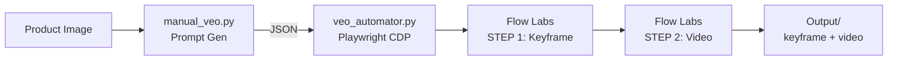

# 🎬 Veo 3.1 Video Automation Pipeline — Walkthrough

## Overview

สร้าง pipeline อัตโนมัติที่เชื่อม `veo_gen` engine (สร้าง prompt) เข้ากับ Google Flow Labs (สร้างวิดีโอ) โดยใช้ Playwright CDP ควบคุม Chrome ที่ user login ไว้แล้ว



---

## Files Created/Modified

### New Files

| File | Purpose |
|------|---------|
| [flow_selectors.py](file:///c:/Users/User/openclaw/dashboard/api/engines/veo_gen/flow_selectors.py) | Calibrated CSS selectors for Flow Labs UI (single source of truth) |
| [veo_automator.py](file:///c:/Users/User/openclaw/dashboard/api/engines/veo_gen/veo_automator.py) | Core Playwright CDP automation — full STEP 1 + STEP 2 pipeline |
| [batch_runner.py](file:///c:/Users/User/openclaw/dashboard/api/engines/veo_gen/batch_runner.py) | Batch processing — run multiple product images sequentially |
| [discover_flow.py](file:///c:/Users/User/openclaw/dashboard/api/engines/veo_gen/discover_flow.py) | Deep DOM inspector for recalibrating selectors when UI changes |

### Modified Files

| File | Change |
|------|--------|
| [engines_api.py](file:///c:/Users/User/openclaw/dashboard/api/engines_api.py) | Added `veo-auto` engine registration + option handling |

---

## Key Design Decisions

### 1. CDP over Launch
ใช้ `connect_over_cdp()` แทน `browser.launch()` เพราะต้องใช้ Google session ที่ login แล้ว + มี credits

### 2. Contenteditable Handling
Flow Labs ใช้ `div[role="textbox"]` ไม่ใช่ `<textarea>` — `fill()` ไม่ทำงาน → ใช้ clipboard paste + keyboard.type fallback

### 3. Non-blocking Screenshots
Screenshots มี 10s timeout แยกจาก main flow — ถ้า font loading ช้า (เกิดบ่อยใน Flow Labs) จะ skip ไม่ block pipeline

### 4. Selector Resilience
ทุก element มี fallback selectors หลายตัว + เก็บใน file เดียว (`flow_selectors.py`) แก้ง่ายเมื่อ UI เปลี่ยน

---

## Calibrated Selectors (from live DOM inspection)

| Element | Selector | Status |
|---------|----------|--------|
| New Project Button | `button:has-text('โปรเจ็กต์ใหม่')` | ✅ Verified |
| Prompt Input (landing) | `textarea` | ✅ Verified |
| Prompt Input (project) | `div[role='textbox']` | ✅ Verified |
| Model Selector | `button:has-text('Nano Banana')` | ✅ Found in project view |
| Upload Button | `button:has-text('เพิ่มสื่อ')` | ✅ Found in project view |
| Send/Create | `button:has-text('สร้าง')` | ✅ Found in project view |
| Result Image | `img[src*='googleusercontent']` | ✅ Verified |
| Result Video | `video` | ✅ Verified |

---

## QA Results

| Test | Result |
|------|--------|
| Syntax compile (all 4 files) | ✅ PASS |
| CDP connection to Chrome:9222 | ✅ PASS |
| Navigate to Flow Labs | ✅ PASS |
| Landing page selector match | ✅ PASS (4/4 expected) |
| Screenshot timeout fix | ✅ PASS (non-blocking) |
| Connect error handling fix | ✅ PASS |

---

## Usage

### Prerequisites
```powershell
# 1. ปิด Chrome ทั้งหมด แล้วเปิดพร้อม debug port
taskkill /F /IM chrome.exe
Start-Process "C:\Program Files\Google\Chrome\Application\chrome.exe" -ArgumentList "--remote-debugging-port=9222"

# 2. Login Google Account ใน Chrome (ครั้งแรกเท่านั้น)
```

### Single Image (CLI)
```bash
# สร้าง prompt อัตโนมัติจากรูป แล้ว automate Flow Labs
python api/engines/veo_gen/veo_automator.py --image "path/to/product.jpg"

# ใช้ prompt ที่สร้างไว้แล้ว
python api/engines/veo_gen/veo_automator.py --prompts-json "prompts.json"

# ข้าม STEP 1 (มี keyframe แล้ว)
python api/engines/veo_gen/veo_automator.py --prompts-json "prompts.json" --skip-keyframe
```

### Batch Processing
```bash
# รันทั้ง folder
python api/engines/veo_gen/batch_runner.py --image-dir ./products/ --delay 60

# Dry run (สร้าง prompt อย่างเดียว ไม่ automate browser)
python api/engines/veo_gen/batch_runner.py --image-dir ./products/ --dry-run
```

### Discovery (recalibrate selectors)
```bash
python api/engines/veo_gen/veo_automator.py --discover
python api/engines/veo_gen/discover_flow.py
```

### Dashboard (Engine Hub)
Engine `VEO Full Automation` ถูก register แล้ว — ใช้ผ่าน Dashboard Engine Hub ได้เลย
